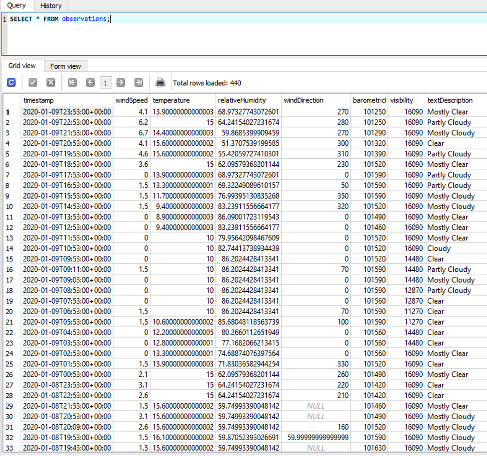

# Querying and Manipulating Data with SQL and Python

## Objectives

- To retrieve data from a database with an embedded SQL query in Python
- To cleanse data and manipulate data from a database in Python
- To save data as a CSV file  
- To open data in Excel and create a chart

## Parts List

- Equipment:
  - Computer running Python

## Introduction

### Lists

One of the most common task a programmer has to do is keep track of a list of objects.

- Lists of phone numbers
- Lists of identification numbers
- etc..

An array can be used to store the list of data items. The array is a simple mechanism used to store a list within a program and allow easy access to any element in the list.

The data stored in the database table can be read into a list and processed by Python. The data from the database must be cleansed with spurious or missing data removed.

Data cleansing is often performed by companies to ensure the data is complete, valid, and standardized

Your data may look different than the above figure. The data needs to be read into lists, then cleansed, sorted, and written out to a file in a format that can be easily read by Excel _or other data analysis programs_.

The database may contain some missing or otherwise invalid data, indicated by the word `NULL` in the query results. These missing or `NULL` values can be removed by Python so that Excel will be able to work with the resulting file.

The following code retrieves only the temperature and relative humidity values from the database, and writes them to a file in comma-separated values (CSV) format that can be read by Excel. Review this code and note the following:

- It includes a SQL SELECT query, similar to the ones you used in SQLiteStudio in the previous step, to get the temperature and humidity data. The ORDER BY clause ensures data are returned in data and time order.
- To create a smaller data set for easier analysis, only the first half of the rows retrieved from the database are processed; this is done by slicing the list of rows.
- The program transforms the data by converting the temperature from degrees Celsius to degrees Fahrenheit.
- It also cleanses the data by using if-else structures to ensure missing or invalid values (indicated by NULL values in the database and by None in Python) are not written to the file.
